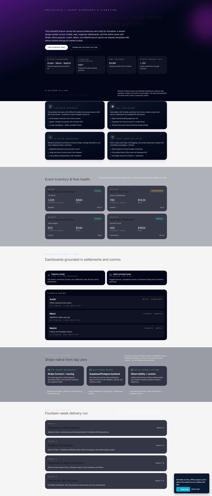
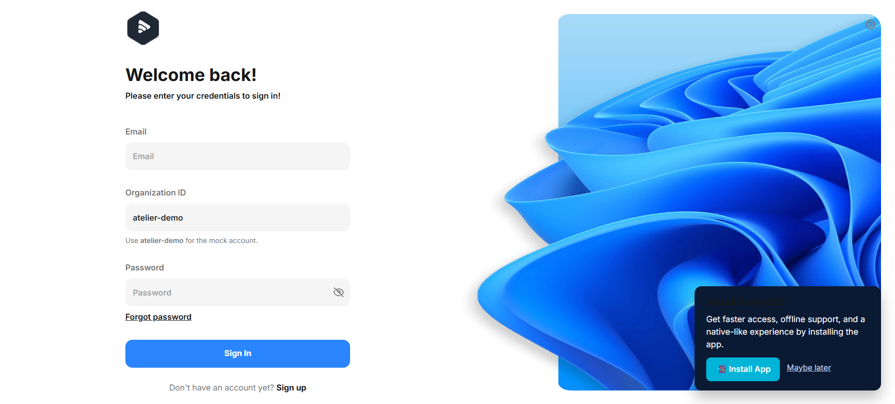
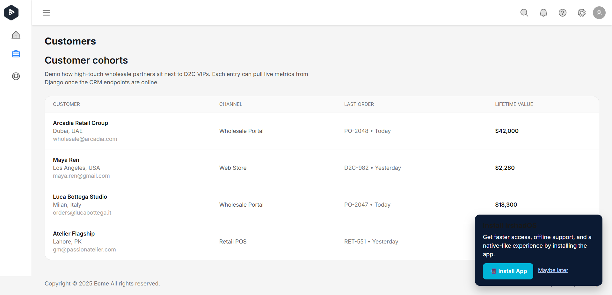
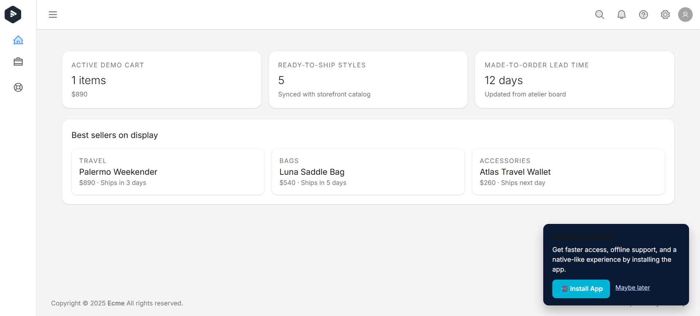
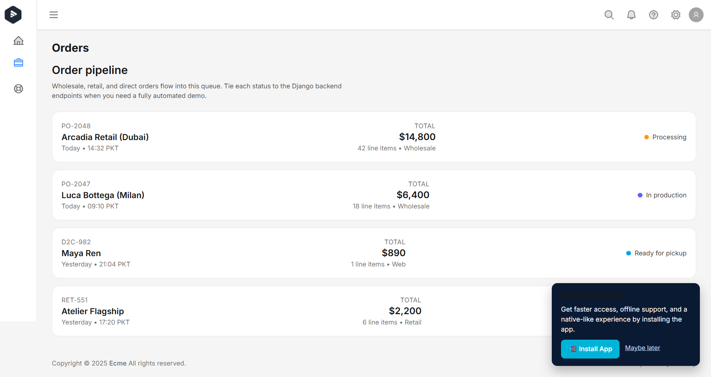
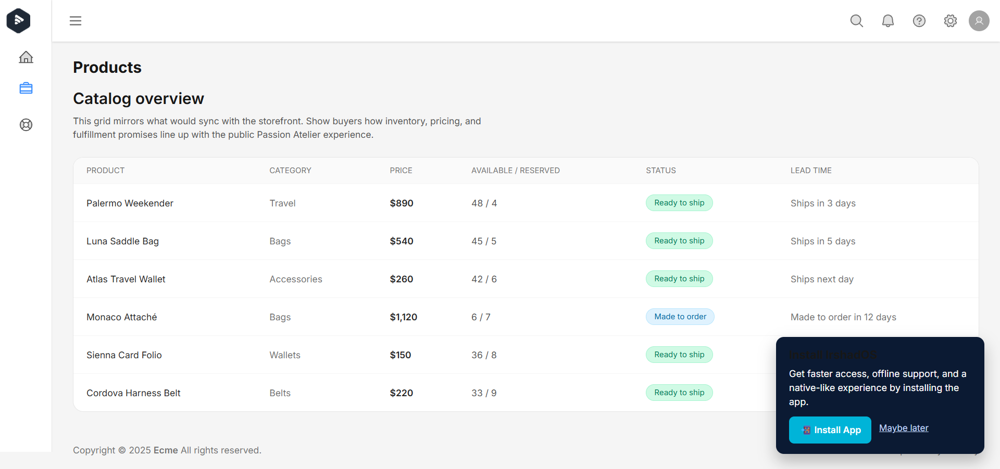

# Socialista – Event Ticketing Platform Demo

This repository packages the assets I reference in my Upwork proposal for the **“Senior Full-Stack Engineer for Event Ticketing Platform”** posting (Nov 17, 2025). It showcases the Socialista architecture across mobile, web, organizer, and admin surfaces plus the supporting Django + React codebases that power the proof-of-architecture.

## Job Snapshot

| Field | Details |
| --- | --- |
| Client ask | Build Socialista, a multi-city event discovery and ticketing platform covering the attendee mobile app, marketing web app, organizer dashboard, and admin cockpit. |
| Core stack | React Native, Next.js 14 (App Router), Postgres/Supabase, Node/Django APIs, Stripe Connect. |
| Launch cities | Austin, Miami, Madrid (initial wave with rapid city expansion thereafter). |
| Engagement | Featured Upwork project · Expert level · $15,000 fixed · 3–6 month timeline. |

## Demo Highlights

- `/socialista` inside `irshados-frontend` renders the entire Socialista case study with the pitch-ready content, KPIs, and calls-to-action that I use in proposals and live walkthroughs.
- The Vite + React admin shell already includes **Products, Orders, Customers, Cohorts, Dashboard analytics, and Organizer previews** so prospects can interact with a working cockpit rather than static Figma slides.
- `irshados-backend` is a Django 5 + DRF API that wires authentication, multi-tenant orgs, and extensible modules (inventory, POS, restaurant pack) mirroring the platform requirements.
- Both apps are production-grade scaffolds with linting, typing, testing, and container-ready Dockerfiles so I can jump into delivery immediately.

## Visual Tour

| Screen | Preview |
| --- | --- |
| Socialista landing + multi-surface storyline |  |
| Admin sign-in + slug-aware auth |  |
| Customer intelligence dashboard |  |
| Command center insights |  |
| Revenue + traffic analytics |  |
| Orders lifecycle pipeline |  |
| Product and seat management |  |

> All screenshots live in `Images/` so you can update or swap visuals without touching the markdown.

## Repository Layout & Local Setup

```
.
├─ README.md                    # This file (proposal companion)
├─ Images/                      # Socialista + admin screenshots used in the README
├─ irshados-frontend/           # React 18 + Vite admin/storefront shell
└─ irshados-backend/            # Django 5 + DRF multi-tenant API
```

### Frontend (`irshados-frontend`)

```bash
cd irshados-frontend
npm install
npm run dev   # launches http://127.0.0.1:5173 with the Socialista demo entry
```

- Uses Tailwind, TanStack Query, React Hook Form, and Vite PWA tooling.
- Visit `/socialista` for the case study or `/sign-in` with `admin-01@ecme.com` / `123Qwe` (`atelier-demo`) to explore the admin cockpit.
- Linting, formatting, tests, and type-checking scripts are available via `npm run lint`, `npm run format`, `npm run test`, and `npm run typecheck`.

### Backend (`irshados-backend`)

```bash
cd irshados-backend
python -m venv .venv && source .venv/bin/activate
pip install --upgrade pip
pip install -r requirements.txt
cp .env.example .env   # provide DATABASE_URL / secrets
python manage.py migrate
python manage.py runserver
```

- Provides Django admin, Swagger docs at `/api/docs/`, JWT auth (SimpleJWT), and extensible domain apps for ticketing, POS, and inventory lifecycles.
- Ships with Dockerfile + Postgres-ready settings to deploy quickly on Fly.io, Railway, Render, or Kubernetes.

## Delivery Roadmap

1. **Phase 1 – Architecture & Sprint Planning (Weeks 1–2)**: UX flows, Supabase schema + RLS, Stripe Connect blueprint, React Native + Next.js scaffolding, CI/CD guardrails.
2. **Phase 2 – Core Feature Development (Weeks 3–7)**: Event discovery feeds, organizer dashboard, admin CMS, multi-city launch orchestration, onboarding, and Supabase integrations.
3. **Phase 3 – Payments & Settlement Engine (Weeks 8–10)**: Stripe Connect onboarding, payouts/fees/commissions, refunds + disputes, webhook-driven analytics.
4. **Phase 4 – QA, Hardening & Launch (Weeks 11–14)**: Load/perf testing, edge caching, production deploys, observability, and ongoing release automation.

Each phase is backed by measurable deliverables (mobile, web, dashboards, payment flows) so stakeholders can validate progress early.

## Proposal Draft (Copy-Ready for Upwork)

> Hello,  
> I’m excited to submit my proposal for Socialista. This project fits right into my core engineering strengths — scalable full-stack systems, mobile + web ecosystems, and event-driven architectures powered by React Native, Next.js, Postgres/Supabase, and Stripe. I’ve already built an architecture extremely close to what you need.  
>  
> To demonstrate execution capability upfront, I’m sharing a fully working proof-of-architecture I built for a multi-city ticketing + e-commerce ecosystem using the same stack you require: I have attached screen shots of my developed system.  
>  
> (Complete front-end + back-end + PWA + admin dashboards + product/catalog/checkout flows)  
>  
> I’m very intentional about shipping enterprise-grade work, measurable results, and futureproof engineering — which is why my clients trust me with high-stakes builds and why I’m Top Rated Plus on Upwork (Top 3% talent).  
>  
> **Why I’m a Fit for Socialista**  
>  
> Your scope includes the exact components I’ve delivered multiple times:  
> ✅ 1. **Mobile App (React Native)** – Delivered Expo/bare apps with secure auth, real-time event feeds, push notifications, deep linking, offline-first PWA patterns.  
> ✅ 2. **Web App (Next.js 14+ / App Router)** – SSR + ISR listings, dynamic venue routing, SWR/TanStack dashboards, installable PWAs. Admin screenshots include sign in, catalog, orders, cohorts, analytics, responsive layouts — all built by me.  
> ✅ 3. **Organizer Dashboard + Admin Panel** – Cohort analytics, organizer permissions, revenue reporting, seat management, Supabase triggers, Stripe webhooks, onboarding flows; matches your scope 1:1.  
> ✅ 4. **Backend Architecture (Postgres/Supabase + Node/Django)** – Event inventory, seat allocation, multi-city launches, dynamic pricing, payouts, audit logs, Node/Django APIs, Supabase RLS, Stripe webhooks; proven across ticketing, energy dashboards, CRMs, multi-tenant marketplaces.  
> ✅ 5. **Stripe Integration (Connect + Issuing + Payouts)** – Connect marketplaces, Checkout/Payment Intents, settlement/refund/dispute webhooks, connected account onboarding, PCI-minimized design, SLA-aligned payouts for high-volume US CRMs.  
>  
> **My Strengths (Forward-Thinking + Gen-Z Precision)**  
> ✨ Modular architectures for multi-city/tenant deployments.  
> ✨ Fast, clean code delivery.  
> ✨ Premium UX execution.  
> ✨ Rigorous documentation/automation for maintainability.  
> ✨ KPI-driven engineering (speed, uptime, DX, performance).  
>  
> I’ve led full-stack development for US companies remotely, so I own the lifecycle end-to-end with clear communication.  
>  
> **Project Execution Plan**  
> _Phase 1 – Architecture & Sprint Planning (Week 1–2)_  
> UX flows, data modeling, Stripe Connect architecture, Supabase schema + RLS, React Native scaffolding, Next.js foundation.  
> _Phase 2 – Core Feature Development (Week 3–7)_  
> Event discovery, organizer dashboard, admin CMS, multi-channel inventory UI, city launch logic, onboarding, Postgres/Supabase integrations.  
> _Phase 3 – Payments & Settlement Engine (Week 8–10)_  
> Stripe Connect onboarding, payouts/fees/commissions, refund/dispute flows, webhooks + real-time sync, sales analytics.  
> _Phase 4 – QA, Hardening & Launch (Week 11–14)_  
> Load testing, edge caching, production deployment, CI/CD, monitoring + observability.  
>  
> **Why You’ll Want to Work With Me**  
> • 18+ years of full-stack + data engineering experience  
> • Top Rated Plus (Top 3% on Upwork)  
> • Shipped multiple React Native + Next.js + Postgres + Stripe ecosystems  
> • Strong leadership + communication  
> • Proven complex platform delivery  
> • Fast, reliable, well-documented engineering  
>  
> Simply put: I don’t just write code — I architect platforms that survive scale, traffic, and real business complexity.  
>  
> **Let’s Build Socialista**  
> If you need someone to own the system end-to-end — architecture, front-end, mobile, backend, payments, devops — I’m ready to deliver Socialista with exceptional quality and velocity. Let’s hop on a call so I can walk you through the demo + architecture.  
>  
> Thanks for considering my proposal — looking forward to building something iconic with you.  
>  
> _Muhammad Kashif Irshad_  
> Senior Full-Stack Engineer | React Native • Next.js • Postgres • Stripe  
> Top Rated Plus – Upwork

---

Feel free to tailor copy, screenshots, or city data before submitting future proposals. This README keeps everything in one place so you can confidently attach the repo and invite clients to explore the live Socialista experience.
